  

<h1 align="center">
  
</h1>

<h3 align="center">☕ Java Backend Developer | 🌱 Spring Boot | 🤖 Python & AI automation | 🧪 Clean code & tests</h3>

  

<h3>🕵️‍♂️ Who am I?</h3>

I'm a Java developer focused on backend development. I like building REST APIs with **Spring Boot**,
designing clean project structure and covering code with tests (**JUnit 5**, **Mockito**, **MockMvc**).

On my GitHub you can find pet projects where I practice real-world things: layered architecture,
validation and error handling, working with databases through **JPA/Hibernate**, **Docker** and **CI with GitHub Actions**.

I also build automation in **Python**: my biggest project is a Telegram bot that creates product cards on
**Wildberries** and **Ozon** using LLMs, image processing and marketplace APIs. It is used in real work every day.

My goal is to grow into a strong backend engineer and to work on products that people actually use.

- 🤖 Built and maintain an **AI Telegram bot for marketplace sellers** (Wildberries / Ozon) used in production
- 🔭 Working on **pet projects with Spring Boot**
- 🌱 Currently learning **Spring Security & JWT, Testcontainers, Kafka**
- ⚡ Fun fact: **every project here has green CI** ✅

<h3 align="left">📬 Let's get in touch:</h3>

  
  

<h3 align="center">🚀 Languages · Frameworks · Tools 🚀</h3>

  

<h3 align="center">🛠️ Projects 🛠️</h3>

<h4>⭐ Featured: <a href="https://github.com/zxcbecause/ai-marketplace-bot">ai-marketplace-bot</a></h4>

Telegram bot that automates work of a marketplace seller: from a product name it finds specs, writes the title,
description and characteristics with an LLM, picks photos, draws infographics and creates the product card on
**Wildberries** / **Ozon** through their APIs. Running in production.

`Python` · `aiogram 3` · `Gemini / DeepSeek / OpenAI` · `Pillow · OpenCV · CLIP` · `SQLite` · `WB & Ozon Seller API`

  

| Project | What it does | Stack |
|---|---|---|
| 🤖 [ai-marketplace-bot](https://github.com/zxcbecause/ai-marketplace-bot) | AI Telegram bot that creates product cards on Wildberries / Ozon | Python · aiogram · LLM · OpenCV |
| 📋 [task-manager-api](https://github.com/zxcbecause/task-manager-api) | REST API for tasks: filters, pagination, validation, Swagger, Docker | Spring Boot · JPA · PostgreSQL · Docker |
| 🔗 [url-shortener](https://github.com/zxcbecause/url-shortener) | Short links with custom aliases, expiry and click stats | Spring Boot · JPA · H2/PostgreSQL |
| 💸 [expense-tracker-cli](https://github.com/zxcbecause/expense-tracker-cli) | Command-line expense tracker with monthly reports | Java 21 · no frameworks |

<h3 align="center">📊 GitHub Stats 📊</h3>

  

  <picture>
    <source media="(prefers-color-scheme: dark)" srcset="https://raw.githubusercontent.com/zxcbecause/zxcbecause/output/github-snake-dark.svg" />
    <source media="(prefers-color-scheme: light)" srcset="https://raw.githubusercontent.com/zxcbecause/zxcbecause/output/github-snake.svg" />
    
  </picture>

  

